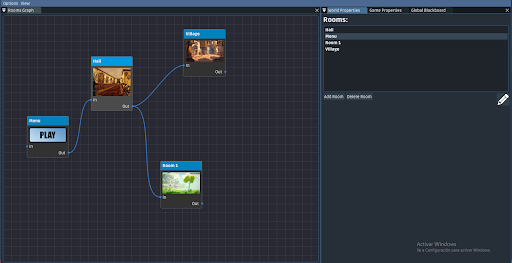
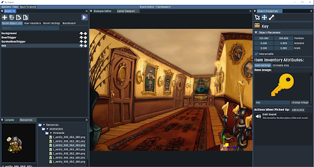
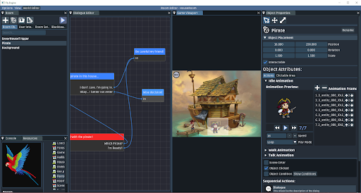

# FlyEngine
FlyEngine is a 2D graphic adventure engine to create simple games without the need of coding/scripting/commands. 

This project will face the problem that people who do not have any previous knowledge about game development are able to create a simple interactive history. To do it I created a tool called FlyEngine which is based on having a very basic and easy to understand UI, also it will not have any type of scripting system nor commands so that the user using the engine does not waste time learning how they work.

There are a lot of graphic adventure games available today that have kept this genre from disappearing since the day the first game came out.

You can download the documentation in: https://docs.google.com/document/d/12Lhz-JCiAQs-mSuXtsdY2O_HDXqO1Pyc_yf5Kc45Mic/edit?usp=sharing

